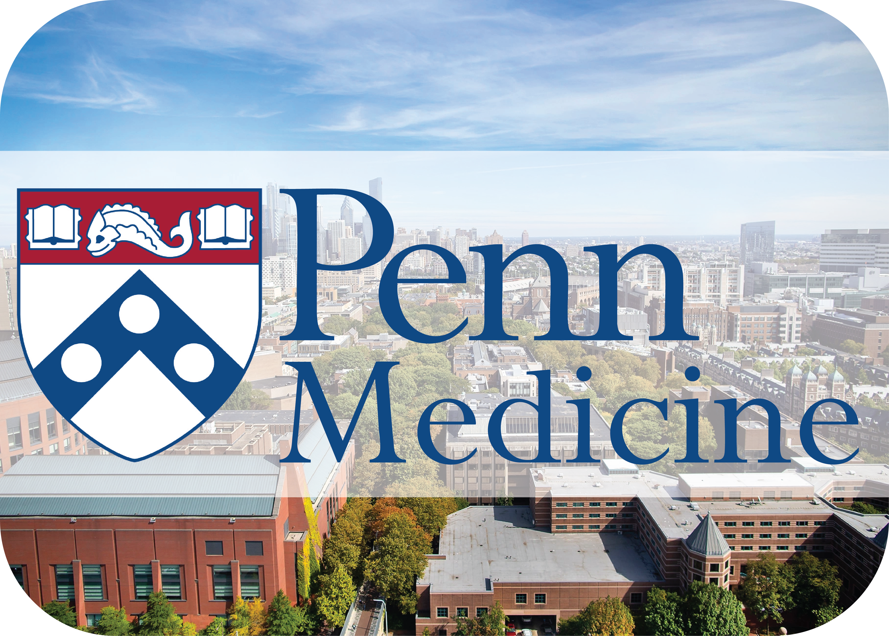

	Coming in 2025 to Philadelphia:
	<h3> The Goodman Lab for Synthetic Immunology</h3>

	

I'm thrilled to start work in [my own laboratory](https://twitter.com/dbgoodman/status/1848752674076037162) at [The University of Pennsylvania in the Department of Cancer Biology](https://www.med.upenn.edu/cbio/). My lab will be located in the [Center for Ceullar Immunotherapies](https://www.med.upenn.edu/cci/) on the Medical School Campus, and will open officially in July 2025.

Watch this space for more info (and a new lab website!), and please [reach out](mailto:dbgoodman@gmail.com) if you are interested in working with us.

---

### Using novel high-throughput approaches to understand and engineer the immune system.

Our understanding of how genomes control biological function is limited by our ability to make modifications and test hypotheses. As it becomes cheaper and faster to both [chemically synthesize DNA](http://www.nature.com/nmeth/journal/v11/n5/abs/nmeth.2918.html) and to [read from cells with next-generation sequencing](https://www.nature.com/articles/nbt.2421), we can identify relationships between DNA sequences and cellular outcomes at an unprecedented scale. This large amount of high-dimensional data can be combined with advancements in artificial intelligence to rapidly predict phenotypes and generate new sequences to test.

During my PhD in George Church's lab at Harvard Medical School, I studied interactions between [bacterial transcription and translation](https://www.ncbi.nlm.nih.gov/pubmed/24072823), built and measured libraries of tuneable synthetic biosensors, and constructed [a new verison of the E. coli genome](https://www.ncbi.nlm.nih.gov/pubmed/24136966) capable of incorporating new synthetic amino acids into its proteins. I also built a high-throughput microbial genome design and analysis software platform called [Millstone](https://churchlab.github.io/millstone/).

As a [Jane Coffin Childs Postdoctoral Fellow](http://www.jccfund.org/) at UCSF, I'm currently applying these high-throughput synthetic approaches to [engineer T cells](https://www.nature.com/nature/journal/v545/n7655/full/nature22395.html) for the treatment of cancer and autoimmune disease. I'm working in the [Bluestone](https://bluestonelab.ucsf.edu/people), [Roybal](https://www.roybal-lab.org/people/), and [Marson](http://marsonlab.ucsf.edu/) labs. We recently published [a study in Science Translational Medicine](https://www.science.org/doi/10.1126/scitranslmed.abm1463) comparing 40 different CAR-T costimulatory signaling domains across multiple pooled assays, and identified signaling motifs from the BAFF receptor - a protein normally associated with B-cell signaling - as driving a distinct cytotoxic phenotype and improving CAR-T efficacy in a preclinical model of multiple myeloma. 

